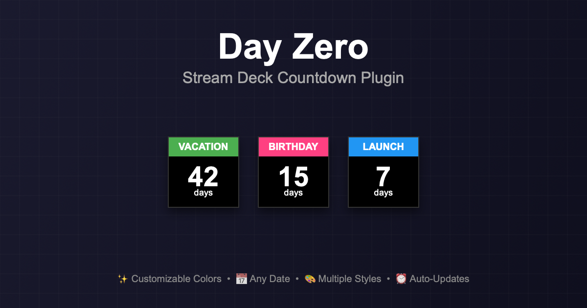

# Day Zero



<p align="center">
  <strong><font size="5">A customizable Stream Deck plugin that counts down the days to your next big event.</font></strong>
</p>

## Features

- **Day Countdown**: Displays the number of days remaining until your target date
- **Custom Event Name**: Set a custom name for your event (e.g., "Vacation", "Birthday", "Launch")
- **Extensive Customization**: Customize fonts, font sizes, and colors for every element
  - Banner background and text color
  - Main display background and text color
  - Font families for banner and countdown number
  - Adjustable font sizes for all text elements
- **Automatic Updates**: Updates daily at midnight and hourly throughout the day
- **Past Date Support**: Shows "X days ago" for dates that have passed

## Installation

### Step 0: Configure Your Plugin

Before building, run the configuration script to set your unique identifiers:

```bash
./configure.sh
```

This interactive script will prompt you for:
- Your reverse domain (e.g., `com.yourcompany`)
- Plugin identifier (e.g., `dayzero`)

It will automatically update the UUID in [manifest.json](manifest.json), bundle name in [build-plugin.sh](build-plugin.sh), and examples in the README.

Alternatively, you can manually update these identifiers in the files mentioned above.

### Option 1: Manual Installation

1. **Build the Plugin Bundle**:
   ```bash
   # Run the build script
   ./build-plugin.sh

   # Or manually create the plugin bundle directory
   mkdir -p "com.yourdomain.dayzero.sdPlugin"

   # Copy all files into the bundle
   cp manifest.json "com.yourdomain.dayzero.sdPlugin/"
   cp plugin.html "com.yourdomain.dayzero.sdPlugin/"
   cp -r propertyInspector "com.yourdomain.dayzero.sdPlugin/"
   cp -r images "com.yourdomain.dayzero.sdPlugin/"
   ```

2. **Install to Stream Deck**:
   ```bash
   # Double-click the bundle to install
   open "com.yourdomain.dayzero.sdPlugin"
   ```

   Or manually copy to the Stream Deck plugins folder:
   ```bash
   cp -r "com.yourdomain.dayzero.sdPlugin" \
     "~/Library/Application Support/com.elgato.StreamDeck/Plugins/"
   ```

3. **Restart Stream Deck**:
   - Quit and reopen the Stream Deck application
   - The "Day Zero" action should appear in the actions list

### Option 2: Development Mode

For testing during development:

1. Create a symbolic link (update the bundle name to match your manifest.json):
   ```bash
   ln -s "$(pwd)" \
     "~/Library/Application Support/com.elgato.StreamDeck/Plugins/com.yourdomain.dayzero.sdPlugin"
   ```

2. Restart Stream Deck application

## Usage

1. **Add the Action**:
   - Open Stream Deck software
   - Find "Day Zero" in the actions list
   - Drag it to a button on your Stream Deck

2. **Configure**:
   - Click the button in Stream Deck software to open settings
   - Set the **Event Name** (e.g., "Vacation")
   - Select the **Target Date**
   - Choose a **Banner Color**

3. **View**:
   - The button will display:
     - Your event name at the top in a colored banner
     - The number of days remaining in large text
     - "days" or "day" label at the bottom

## Configuration Options

### Event Name
- **Type**: Text (max 20 characters)
- **Default**: "Event"
- **Description**: The name displayed on the banner

### Target Date
- **Type**: Date picker
- **Required**: Yes
- **Description**: The date you're counting down to

### Styling Options
- **Banner Background Color**: Color picker (default: #4CAF50)
- **Banner Text Color**: Color picker (default: #FFFFFF)
- **Banner Font**: Font family selector (default: Arial)
- **Banner Font Size**: 10-24px (default: 24)
- **Main Background Color**: Color picker (default: #000000)
- **Main Text Color**: Color picker (default: #FFFFFF)
- **Number Font**: Font family selector (default: Arial)
- **Number Font Size**: 24-72px (default: 48)
- **Label Font Size**: 12-32px (default: 20)

## Technical Details

### File Structure
```
com.yourdomain.dayzero.sdPlugin/
├── manifest.json              # Plugin metadata and configuration
├── plugin.html               # Main plugin logic and rendering
├── propertyInspector/
│   └── index.html            # Configuration UI
└── images/
    ├── action-icon.png       # Action icon (144x144)
    ├── action-icon@2x.png    # Action icon retina (288x288)
    ├── plugin-icon.png       # Plugin icon (144x144)
    ├── plugin-icon@2x.png    # Plugin icon retina (288x288)
    ├── category-icon.png     # Category icon (144x144)
    └── category-icon@2x.png  # Category icon retina (288x288)
```

### How It Works

1. **WebSocket Communication**: The plugin communicates with Stream Deck via WebSocket
2. **Canvas Rendering**: Each button is rendered using HTML5 Canvas API
3. **Date Calculation**: Days are calculated using JavaScript Date objects
4. **Auto Updates**:
   - Hourly interval checks for changes
   - Midnight update scheduled daily
5. **Settings Storage**: Stream Deck manages settings persistence

### Supported Platforms

- **macOS**: 10.13 or later
- **Stream Deck Software**: 6.0 or later

## Customization

### Appearance Customization

You can customize the appearance through the Property Inspector in Stream Deck, or by editing [plugin.html](plugin.html) for advanced changes:

- **Canvas Size**: Default 144x144 pixels
- **Fonts**: All fonts and sizes configurable via UI
- **Colors**: All colors configurable via UI
- **Layout**: Adjust positioning of elements in code

### Custom Icons (Optional)

The plugin comes with pre-generated icons, but you can create your own custom icons if desired:

1. **Open the Icon Generator**:
   ```bash
   open images/icon-generator.html
   ```

2. **Customize Your Icons**:
   - Modify the colors, text, or design in the generator
   - The generator creates all required sizes automatically

3. **Download Icon Files**:
   - Click the download buttons for each icon
   - Or right-click each canvas and select "Save Image As..."
   - Save them in the `images/` directory with these exact names:
     - `action-icon.png` (144x144)
     - `action-icon@2x.png` (288x288)
     - `plugin-icon.png` (144x144)
     - `plugin-icon@2x.png` (288x288)
     - `category-icon.png` (144x144)
     - `category-icon@2x.png` (288x288)

4. **Rebuild and Reinstall**:
   ```bash
   ./build-plugin.sh
   open "com.yourdomain.dayzero.sdPlugin"
   ```

   Then restart the Stream Deck application to see your custom icons.

**Note**: The category icons can be the same as the plugin icons if you don't need different designs for each.

## Troubleshooting

### Plugin doesn't appear in Stream Deck
- Ensure all required icon files are present
- Check that `manifest.json` is valid JSON
- Restart Stream Deck application
- Check Console.app for errors (filter by "Stream Deck")

### Countdown not updating
- Verify the target date is set correctly
- Check WebSocket connection in browser console
- Restart Stream Deck application

### Icons not displaying
- Verify icon files exist in `images/` directory
- Ensure icons are PNG format with correct dimensions
- Check file naming matches `manifest.json`

## Development

### Prerequisites
- macOS 10.13 or later
- Stream Deck device and software
- Text editor or IDE

### Making Changes

1. Edit files in the plugin directory
2. Restart Stream Deck application to reload plugin
3. Test changes on your Stream Deck

### Debugging

1. Open Stream Deck software
2. Open Console.app (macOS)
3. Filter for "Stream Deck"
4. View plugin logs and errors

## License

Apache License 2.0 - See [LICENSE](LICENSE) for details.

## Support

For issues or feature requests, please create an issue in the repository.

## Future Enhancements

Possible features to add:
- Multiple date formats
- Countdown to time (hours/minutes)
- Background images
- Progress bar visualization
- Week/month countdown options
- Multiple language support

---

*This project was created with the assistance of AI coding tools.*
